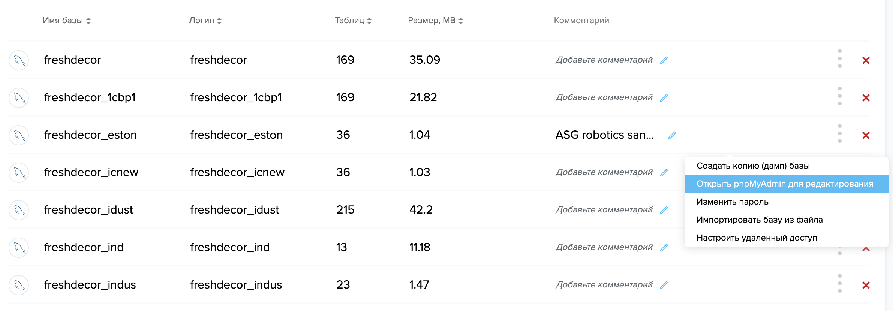
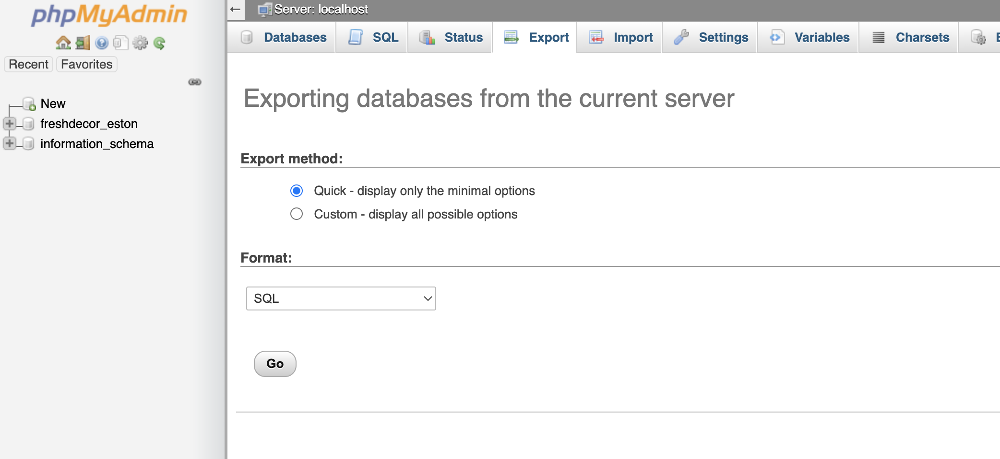

1. Создать в /sandbox директорию `secrets` и внутри два фалы: db и pwd. В них должны быть имя базы и пароль соотвественно.
2. Скачать актуальную версию дампа базы. 
   1. Зайти сюда: https://cp.sweb.ru/hosting/database
   2. Открыть phpMyAdmin для редактирования freshdecor_eston 
   3. Выбрать наверху Export -> Нажать кнопку Go 
   4. То, что скачалось положить в sandbox/db_init/
3. Зайти в sandbox/ и выполнить `docker-compose up`. Подождать минутку. Открыть http://localhost (должно работать)